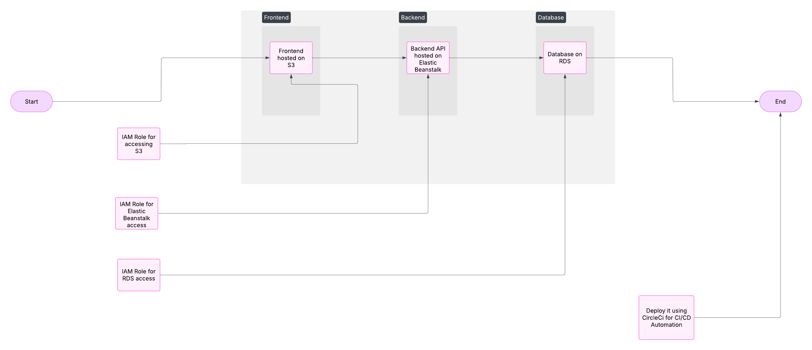

# Infrastructure Description

## AWS Services Used

### 1. **Amazon RDS (Relational Database Service)**

- **Purpose**: Hosts the backend database used PostgreSQL.

### 2. **Amazon S3**

- **Purpose**: Stores static files by create a bucket and make it public access.

### 3. **Elastic Beanstalk**

- **Purpose**: Hosts the API.
- **Environment**: Node.js.
-

### 4. **IAM Roles and Policies**

- The project uses IAM roles for securing resources, including S3, Elastic Beanstalk, and RDS access.

#### A diagram below giving a high-level overview of the infrastructure.

